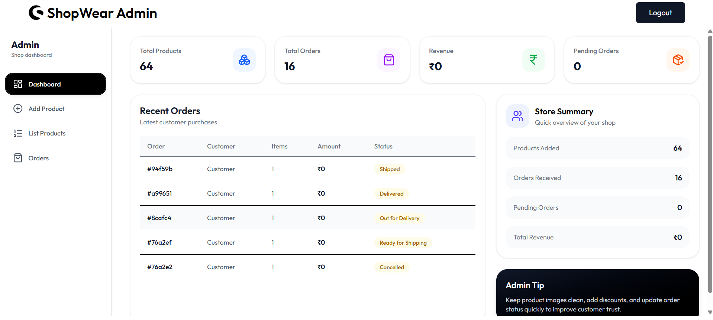
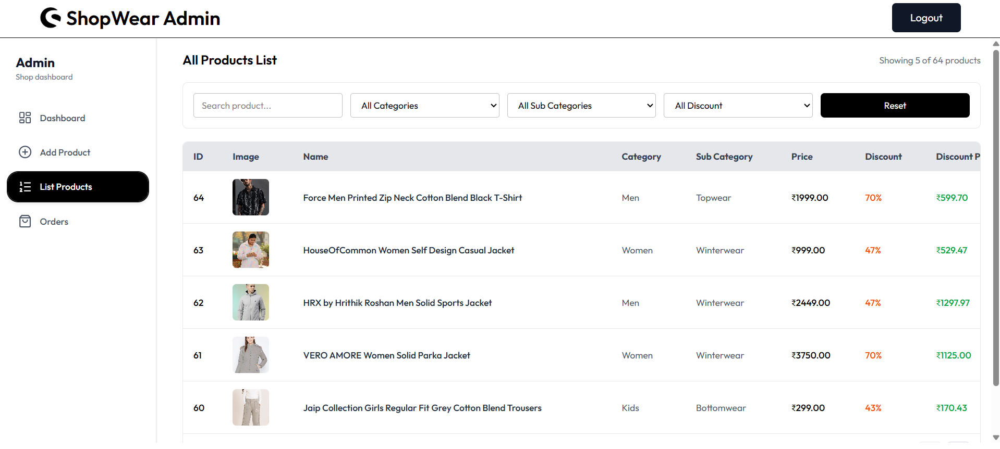
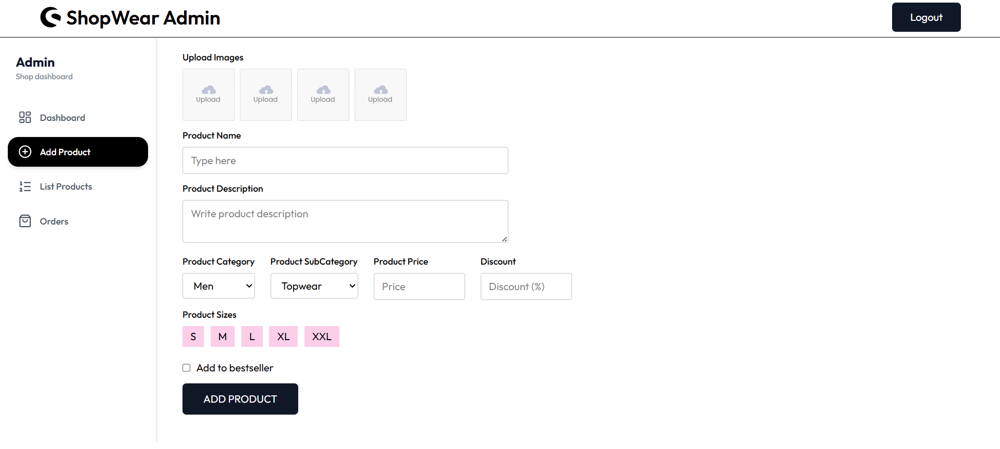
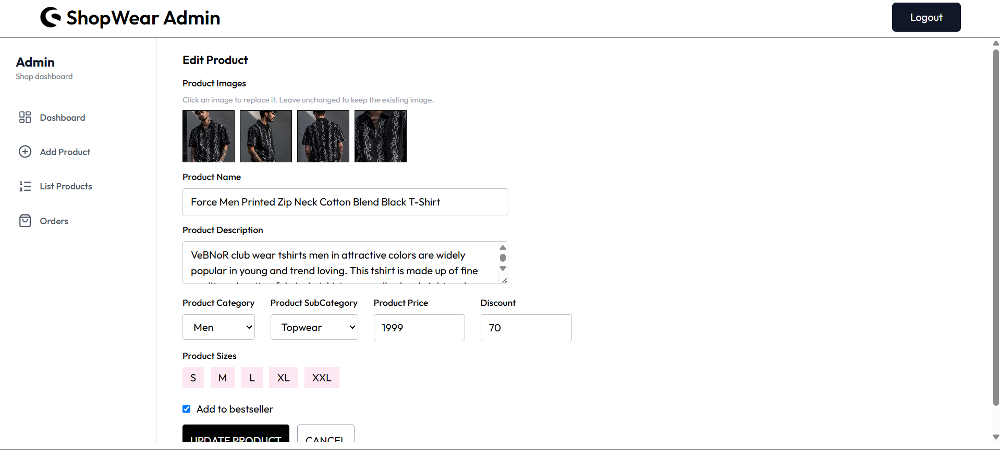
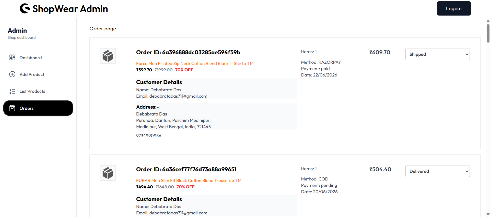

# 🛍️ ShopWear

A full-stack MERN E-Commerce Platform developed as a **Final Year College Project**. ShopWear provides a complete online shopping experience with secure authentication, product management, cart functionality, order processing, and an admin dashboard for store management.

## 🎓 Academic Project

**Project Title:** ShopWear – MERN E-Commerce Platform

**Project Type:** Final Year College Project

**Technology Stack:** MERN Stack (MongoDB, Express.js, React.js, Node.js)

**Objective:**  
To develop a modern and scalable e-commerce platform that enables customers to browse products, manage carts, place orders, and allows administrators to efficiently manage products and orders through a dedicated dashboard.

---

## 📸 Screenshots

### Login Page, SignUp Page, Forgot Password Page & Profile Page

<p align="center">
  
  
  
  
</p>

### Home Page, Collections Page, About Page & Contact Page

<p align="center">
  
  
  
  
</p>

### Product Details Page, Wishlist Page, Shopping Cart Page & Chekout Page

<p align="center">
  
  
  
  
</p>

### Razorpay Payment Page, Order Success Page, Order History Page & Order Tracking Page

<p align="center">
  
  
  
  
</p>

### Admin Dashboard, Admin Product List Page, Admin Add Product Page, Admin Edit Product Page & Admin All Order List Page

<p align="center">
  
  
  
  
  
</p>

---

## 🚀 Features

### 👤 User Features

- User Registration & Login
- Secure JWT Authentication
- Browse Products
- Product Search & Filtering
- Product Details Page
- Add to Cart
- Update Cart Quantity
- Remove Items from Cart
- Place Orders
- Order History
- Responsive User Interface

### 🛠️ Admin Features

- Secure Admin Login
- Dashboard Overview
- Add New Products
- Edit Products
- Delete Products
- Manage Orders
- Update Order Status
- Product Inventory Management

### ☁️ Image Management

- Product Image Upload
- Multer Integration
- Cloudinary Storage
- Optimized Image Delivery

---

## 🏗️ Tech Stack

### Frontend

- React.js
- React Router DOM
- Axios
- Tailwind CSS
- React Toastify

### Backend

- Node.js
- Express.js
- JWT Authentication
- Bcrypt.js
- Multer
- Cloudinary

### Database

- MongoDB Atlas
- Mongoose

---

## 📁 Project Structure

```text
ShopWear/
│
├── frontend/
│   ├── src/
│   └── public/
│
├── admin/
│   ├── src/
│   └── public/
│
├── backend/
│   ├── config/
│   ├── controllers/
│   ├── middleware/
│   ├── models/
│   ├── routes/
│   └── utils/
│
└── README.md
```

---

## 🔧 Installation

### Clone Repository

- git clone https://github.com/dev-debabrata/shopwear-ecommerce-mern.git
- cd shopwear-mern-ecommerce

### Backend Setup

```
cd backend
npm install
npm run dev
```

### Frontend Setup

```
cd frontend
npm install
npm run dev
```

### Admin Setup

```
cd admin
npm install
npm run dev
```

## 🔐 Authentication & Security

- JWT Authentication
- Password Hashing with Bcrypt
- Protected Routes
- Admin Authorization
- Secure API Access

---

## ☁️ Cloudinary Integration

The application uses Cloudinary and Multer for:

- Product Image Uploads
- Cloud-Based Storage
- Fast Image Delivery
- Optimized Media Management

---

## 📦 Core Modules

- User Management
- Product Management
- Shopping Cart
- Order Processing
- Admin Dashboard
- Image Upload System

---

## 🎯 Learning Outcomes

Through this project, I gained practical experience in:

- Full-Stack Web Development
- REST API Development
- Database Design with MongoDB
- Authentication & Authorization
- Cloudinary Media Management
- State Management in React
- Deployment & Production Configuration

---

## 👨‍💻 Developer

**Debabrata Das**

B.Tech – Computer Science & Engineering

Frontend Developer | MERN Stack Developer

GitHub: https://github.com/dev-debabrata

---

## ⭐ Acknowledgements

This project was developed as a Final Year College Project to demonstrate practical implementation of modern web development technologies using the MERN Stack.

---

## 📄 License

This project is developed for educational and academic purposes.
